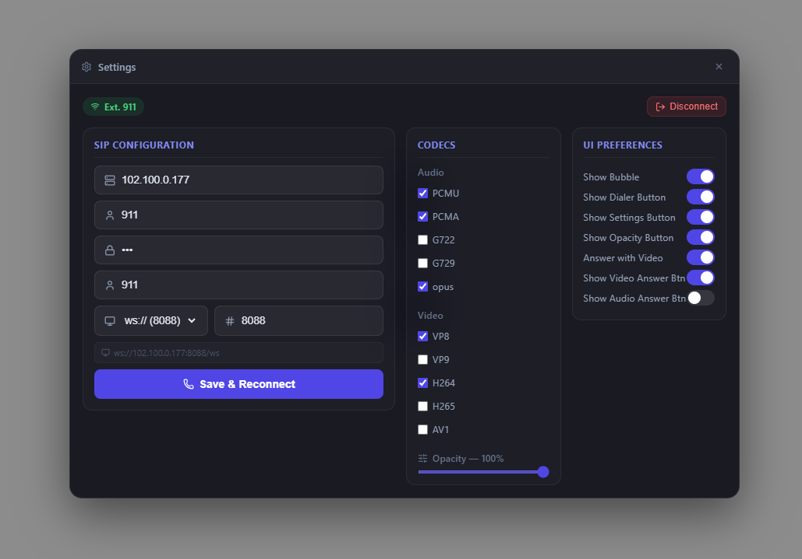
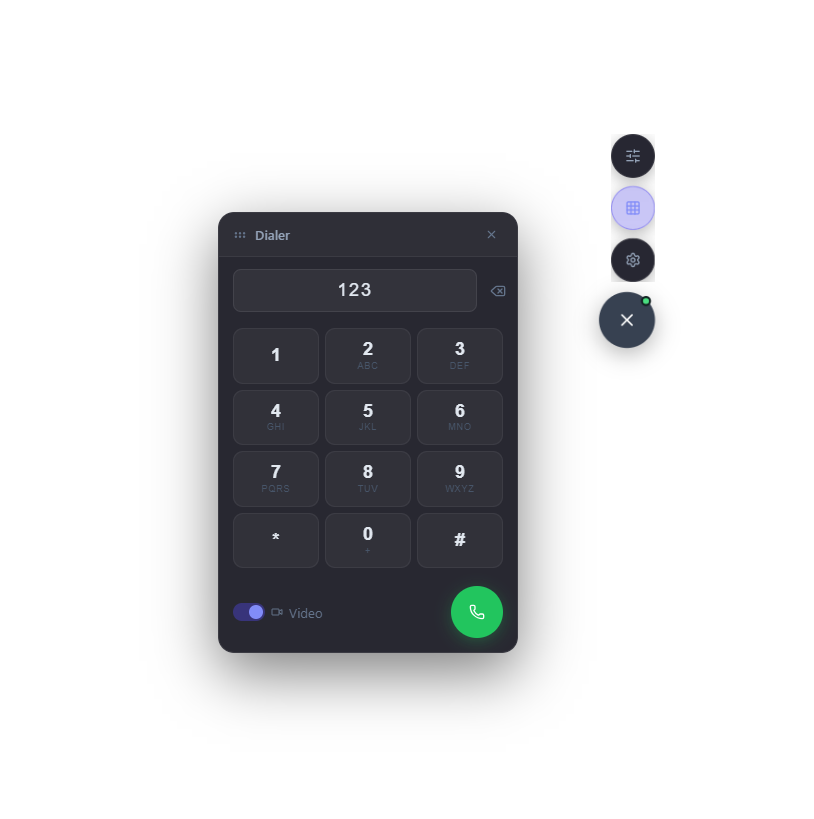
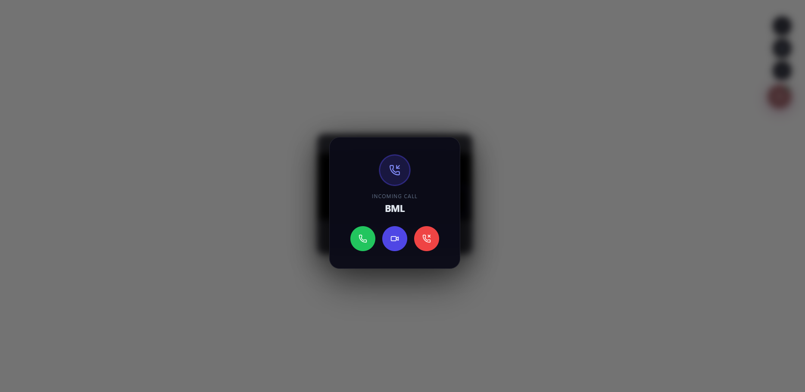
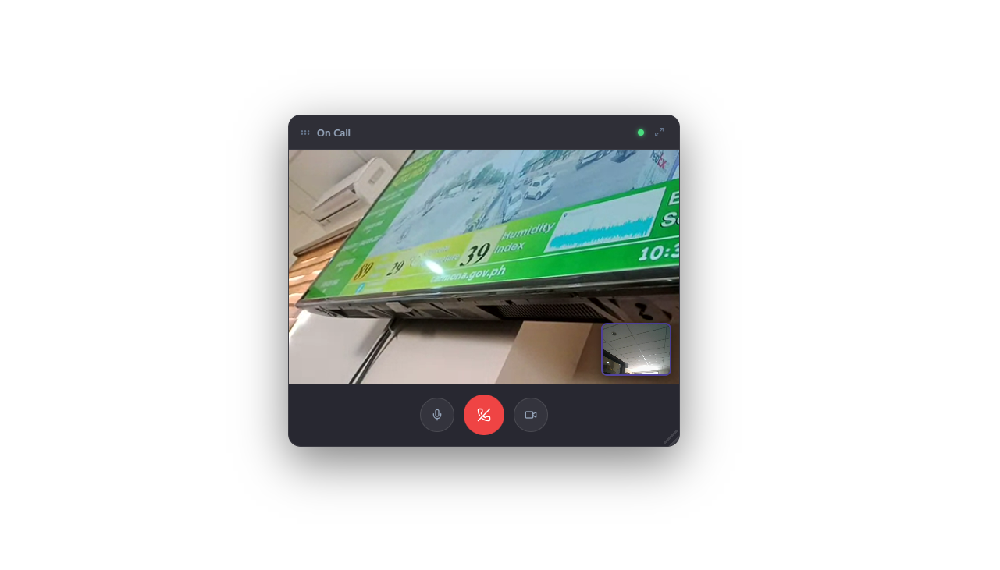

# juv-ksip-softphone

A professional, draggable, resizable, transparent React WebRTC SIP softphone component for FreePBX / Asterisk. Supports audio and video calls, incoming call handling, codec selection, and a global `ksipcall` API for triggering calls from anywhere in your app.

---

## Screenshots

<p align="center">
  
  
</p>
<p align="center">
  
  
</p>

---

## Features

- 🎙 Audio & video calls via WebRTC + SIP (FreePBX / Asterisk)
- 📞 Incoming call notifications with accept/reject
- 🪟 Draggable + resizable floating video panel (expandable to fullscreen)
- 🔢 Draggable dialpad panel
- 💾 Auto-saves config to `localStorage` and auto-connects on reload
- 🔄 Auto-reconnects on WebSocket disconnect
- 🌐 Transparent background — overlays any existing app
- 🎛 Floating messenger-style FAB nav (settings, dialer, opacity)
- 📡 Global `ksipcall` API — trigger calls from plain JS or any framework
- 🔒 ws:// / wss:// protocol selector
- 🎚 Audio & video codec selection
- ⚙ Fully configurable via props and in-app settings panel
- 🔔 Ringtones for incoming and end call

---

## Installation

```bash
npm install react-sip-softphone
```

---

## Quick Start

```jsx
import { Softphone } from 'react-sip-softphone';
import 'react-sip-softphone/styles';

function App() {
  return (
    <>
      <YourExistingApp />
      <Softphone />
    </>
  );
}
```

The softphone renders as a transparent overlay with a floating phone button (top-right). Click it to open the nav menu.

---

## Props

### SIP Connection Props

| Prop | Type | Default | Description |
|---|---|---|---|
| `server` | `string` | `""` | FreePBX server IP or hostname |
| `wsProtocol` | `"ws"` \| `"wss"` | `"ws"` | WebSocket protocol. Use `wss` for HTTPS pages |
| `wsPort` | `string` | `"8088"` | WebSocket port (`8088` for ws, `8089` for wss) |
| `extension` | `string` | `""` | SIP extension number |
| `password` | `string` | `""` | SIP extension password |
| `displayName` | `string` | `""` | Caller ID display name (optional) |

### UI Props

| Prop | Type | Default | Description |
|---|---|---|---|
| `enabledBubble` | `boolean` | `true` | Show or hide the entire softphone bubble |
| `showDialer` | `boolean` | `true` | Show the dialer button in the FAB nav |
| `showSetting` | `boolean` | `true` | Show the settings button in the FAB nav |
| `showOpacity` | `boolean` | `true` | Show the opacity button in the FAB nav |
| `answerwithVideoCall` | `boolean` | `false` | Auto-answer incoming calls with video. Forces `ShowIncomingCallAudio` to `false` |
| `ShowIncomingCallVideoBtn` | `boolean` | `true` | Show the video answer button on incoming calls |
| `ShowIncomingCallAudio` | `boolean` | `true` | Show the audio answer button on incoming calls. Forced `false` when `answerwithVideoCall=true` |

### Priority Order

Props are used as **initial defaults**. If the user has previously saved a config via the settings panel, `localStorage` takes priority. This allows the user to override props from within the app.

---

## Examples

### Basic — manual config via settings panel

```jsx
<Softphone />
```

### Pre-configured — auto-connect on load

```jsx
<Softphone
  server="192.168.1.100"
  wsProtocol="ws"
  wsPort="8088"
  extension="1001"
  password="mypassword"
  displayName="John Doe"
/>
```

### Full configuration

```jsx
<Softphone
  // SIP Connection
  server="192.168.1.100"
  wsProtocol="ws"
  wsPort="8088"
  extension="1001"
  password="mypassword"
  displayName="John Doe"
  // UI
  enabledBubble={true}
  showDialer={true}
  showSetting={true}
  showOpacity={true}
  answerwithVideoCall={false}
  ShowIncomingCallVideoBtn={true}
  ShowIncomingCallAudio={true}
/>
```

### Audio-only mode (no video answer button)

```jsx
<Softphone
  ShowIncomingCallVideoBtn={false}
  ShowIncomingCallAudio={true}
/>
```

### Auto-answer with video

```jsx
<Softphone
  answerwithVideoCall={true}
  // ShowIncomingCallAudio is automatically false
/>
```

### wss:// for HTTPS pages

```jsx
<Softphone
  server="pbx.yourdomain.com"
  wsProtocol="wss"
  wsPort="8089"
  extension="1001"
  password="mypassword"
/>
```

---

## ksipcall API

The `ksipcall` global lets you trigger calls from **anywhere** — plain JavaScript, Vue, Angular, or any other framework.

### Audio Call

```js
ksipcall.audio("123");
```

### Video Call

```js
ksipcall.video("123");
```

### Via window (plain HTML / vanilla JS)

```html
<button onclick="ksipcall.audio('123')">Call Support</button>
<button onclick="ksipcall.video('456')">Video Call</button>
```

### Import in React / other frameworks

```js
import { ksipcall } from 'react-sip-softphone';

ksipcall.audio("123");
ksipcall.video("123");
```

---

## useSIP Hook (Advanced)

Use the hook directly if you want to build your own UI:

```jsx
import { useSIP } from 'react-sip-softphone';

function MyPhone() {
  const {
    registered,       // boolean — SIP registration status
    callState,        // "idle" | "ringing" | "incoming" | "active"
    incomingSession,  // sip.js Invitation object
    error,            // string | null
    reconnecting,     // boolean
    localVideoRef,    // ref → attach to <video> for local camera
    remoteVideoRef,   // ref → attach to <video> for remote video
    remoteAudioRef,   // ref → attach to <audio> for remote audio
    call,             // (target: string, withVideo?: boolean) => void
    answer,           // (withVideo?: boolean) => void
    hangup,           // () => void
    mute,             // (muted: boolean) => void
    toggleVideo,      // (disabled: boolean) => void
  } = useSIP({
    server: "192.168.1.100",
    wsServer: "ws://192.168.1.100:8088/ws",
    extension: "1001",
    password: "secret",
    displayName: "John Doe",
  });

  return (
    <>
      <audio ref={remoteAudioRef} autoPlay />
      <video ref={remoteVideoRef} autoPlay playsInline />
      <video ref={localVideoRef} autoPlay playsInline muted />
      <p>Status: {registered ? "Registered" : "Not registered"}</p>
      <button onClick={() => call("1002")}>Call 1002</button>
      <button onClick={() => call("1002", true)}>Video Call 1002</button>
      {callState === "incoming" && (
        <>
          <button onClick={() => answer()}>Answer Audio</button>
          <button onClick={() => answer(true)}>Answer Video</button>
          <button onClick={hangup}>Reject</button>
        </>
      )}
      {callState === "active" && (
        <button onClick={hangup}>Hang Up</button>
      )}
    </>
  );
}
```

---

## Settings Panel

The in-app settings panel (accessible via the ⚙ button) has a **3-column layout**:

### Column 1 — SIP Configuration
| Field | Description | Example |
|---|---|---|
| FreePBX Server IP | IP or hostname | `192.168.1.100` |
| Extension | SIP extension number | `1001` |
| Password | Extension SIP password | `mypassword` |
| Display Name | Caller ID name (optional) | `John Doe` |
| Protocol | `ws://` or `wss://` | `ws://` |
| Port | WebSocket port | `8088` |

### Column 2 — Codecs

**Audio Codecs:** `PCMU`, `PCMA`, `G722`, `G729`, `opus`

**Video Codecs:** `VP8`, `VP9`, `H264`, `H265`, `AV1`

**Opacity:** FAB bubble opacity slider (min 30%)

### Column 3 — UI Preferences

All UI props are configurable as toggles:
- Show Bubble
- Show Dialer Button
- Show Settings Button
- Show Opacity Button
- Answer with Video
- Show Video Answer Button
- Show Audio Answer Button

---

## WebSocket Protocol

| Protocol | Port | Use Case |
|---|---|---|
| `ws://` | `8088` | Local network, HTTP pages |
| `wss://` | `8089` | Production, HTTPS pages (requires SSL cert on FreePBX) |

> **Note:** Browsers block `ws://` (insecure) when the page is served over `https://`. Use `wss://` with a valid SSL certificate for production.

---

## FreePBX / Asterisk Requirements

For WebRTC to work, each SIP extension must have these settings:

| Setting | Value |
|---|---|
| `webrtc` | `yes` |
| `use_avpf` | `yes` |
| `media_encryption` | `dtls` |
| `ice_support` | `yes` |
| `bundle` | `yes` |
| `rtcp_mux` | `yes` |
| `dtls_setup` | `actpass` |

### Enable via FreePBX Admin UI

1. **Applications → Extensions → [your extension]**
2. Tab: **Advanced**
3. Set **WebRTC** → `Yes`
4. **Submit → Apply Config**

### Enable via CLI (pjsip.endpoint_custom.conf)

```ini
[1001](+)
webrtc=yes
```

```bash
asterisk -rx "pjsip reload"
```

---

## Floating Nav Controls

| Button | Action |
|---|---|
| 📞 Phone (FAB) | Open / close the nav menu |
| ⊞ Grid | Toggle dialpad panel |
| ⚙ Settings | Toggle settings & SIP config panel |
| ≡ Sliders | Quick opacity adjustment (min 30%) |

---

## localStorage

Config is automatically saved under the key `sip_softphone_config` and restored on next page load, including:
- SIP credentials (server, extension, password, display name)
- WebSocket protocol and port
- Selected audio/video codecs
- UI preferences (all toggle states)

---

## NPM Publishing

```bash
# Build the library
npm run build:lib

# Publish
npm publish
```

---

## License

MIT
